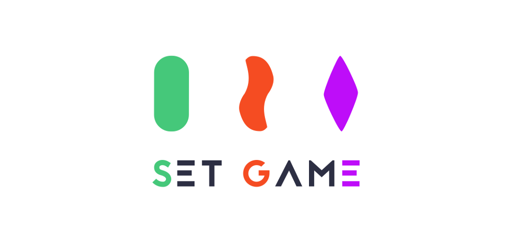

# Daily Set Game Solver

    

## About this project

Set Solver is simple project that demonstrates usage of clean architecture with MVVM pattern. This is not common approach as clean architecture is widely used with MVP pattern, so I've decided to give that combination a try.

## What does this app do?

Set Solver provides solution to [Daily Set Puzzle](https://www.setgame.com/set/puzzle).

If you would like to find out more about game itself, please follow [this link](https://puzzles.setgame.com/set/rules_set.htm).

From the technical point of view, this application fetches today's Set Puzzle, solves it and displays the solution in single Activity. Puzzle is downloaded as raw htm file and then parsed, as the site does not provide any REST API. User can click row to select it as already solved to avoid mistakes.

You can download this app from Google Play Store

## Architecture

Project is using clean architecture along with MVVM pattern. It also fully written in kotlin with support from RxJava.

**What is clean architecture?**
The Clean Architecture demonstrates strategies to help solve or avoid these common problems. It is designed to be testable, independent from UI, database or any external data source. Read more in articles below:

[Architecting Android...The clean way?](https://fernandocejas.com/2014/09/03/architecting-android-the-clean-way/)

[What is all this Clean Architecture jibber-jabber about?](http://pguardiola.com/blog/clean-architecture-part-1/)

[Android Architecture Blueprints](https://github.com/googlesamples/android-architecture)

## Languages, libraries and tools used

* [Kotlin](https://kotlinlang.org/) - future of Android developement 
* [RxJava2](https://github.com/ReactiveX/RxJava/wiki/What's-different-in-2.0) - for data manipulation 
* [RxAndroid](https://github.com/ReactiveX/RxAndroid) - for schedulers and more 
* [Dagger 2](https://github.com/google/dagger) - for dependency injection 
* [Pine](https://github.com/bskierys/Pine),[Timber](https://github.com/JakeWharton/timber) - for simple logging 
* [Mockito](http://mockito.org/) - for mocking in tests 
* [Jsoup](https://jsoup.org/) - for downloading puzzle 
* [RxNetwork](https://github.com/pwittchen/ReactiveNetwork) - to listen for network changes the Rx way 

**Application is also build upon two boilerplate projects:**

* [Kotlin-Android-Boilerplate](https://github.com/Plastix/Kotlin-Android-Boilerplate) - MVVM Boilerplate in kotlin 
* [Android Clean Architecture Boilerplate](https://github.com/bufferapp/android-clean-architecture-boilerplate) - Clean Architecture Boilerplate in kotlin 

## License

    Copyright 2018 Bartłomiej Kierys

    Licensed under the Apache License, Version 2.0 (the "License");
    you may not use this file except in compliance with the License.
    You may obtain a copy of the License at

       http://www.apache.org/licenses/LICENSE-2.0

    Unless required by applicable law or agreed to in writing, software
    distributed under the License is distributed on an "AS IS" BASIS,
    WITHOUT WARRANTIES OR CONDITIONS OF ANY KIND, either express or implied.
    See the License for the specific language governing permissions and
    limitations under the License.
